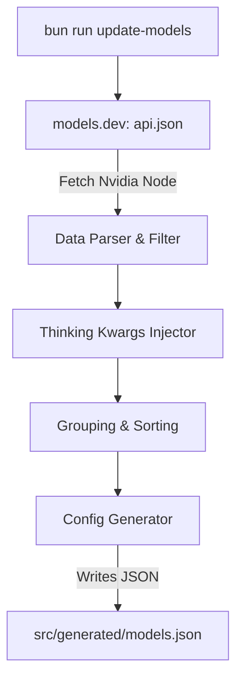

# Spec: Dynamic Model Discovery & Auto-Update

## Background & Objectives
Currently, `pi-nvidia-nim` maintains a hardcoded model metadata list (including `contextWindow`, `maxTokens`, `reasoning`, and `input` modalities). When new models are released or existing models are updated:
- The metadata becomes outdated, resulting in subpar defaults (e.g., `4096` context window).
- Adding new models requires manual code modification and pull requests.
- The process is error-prone and slow.

This specification outlines the **pi-nvidia-adapter** approach: automating model discovery and metadata synchronization by combining NVIDIA's API endpoint with **models.dev**'s rich open-source database.

---

## 1. Core Architecture

The system uses a single offline build script (`bun run update-models`) to fetch, merge, rank, and generate the final model config JSON.



### Script Execution Flow (`bun run update-models`)
1. **Fetch Database**: Request global models.dev registry at `https://models.dev/api.json` (no authentication required).
2. **Filter & Parse**: Extract and filter all models defined in the `nvidia` provider block, skipping embedding and safety guard models.
3. **Heuristics Mapping**: For any model ID lacking metadata fields, apply conservative heuristic rules to estimate its limits.
4. **Thinking Config Generation**: Dynamically assign thinking configurations based on the model family.
5. **Sort**: Group models by company/creator and sort internally by release freshness.
6. **Overwrite Write**: Output and overwrite the newly generated configuration object directly into `src/generated/models.json`.

### Runtime API Key Resolution Strategy
The offline synchronization script runs with zero authorization required. However, the runtime plugin (`index.ts`) resolves active NVIDIA API credentials for standard endpoint querying and live incremental discovery at startup in the following priority order:
1. **Environment Variables**: Prioritize checking `NVIDIA_API_KEY`, and fall back to `NVIDIA_NIM_API_KEY`.
2. **Pi Coding Agent `auth.json` Configuration**: Locate the Pi Agent global configuration folder (via `getAgentDir()` or reading `~/.config/pi-coding-agent/auth.json`) and parse the credential stored under `"nvidia-nim"`.

---


## 2. Key Data Fields & Merger Logic

We will extract the `nvidia` node from `https://models.dev/api.json` which contains a `models` mapping keyed by model ID.

### Target Model Properties
We map data fields from models.dev into the Pi-compatible `NimModelEntry` structure:

| Pi Field | models.dev Source | Heuristic Fallback (if not in models.dev) |
| :--- | :--- | :--- |
| `id` | `id` (e.g. `z-ai/glm4.7`) | The discovered model ID |
| `name` | `name` | Human-readable representation of `id` |
| `contextWindow` | `limit.context` | `128000` (industry standard) or parsed from ID (e.g. `128k`) |
| `maxTokens` | `limit.output` | `4096` |
| `reasoning` | `reasoning` | `true` if ID contains `r1`, `reasoning`, `thinking`, `qwq`, `glm5` |
| `input` | `modalities.input` | `["text", "image"]` if ID contains `vision`, `vl`, `multimodal` |

### Provider Thinking Configuration Mapping
Rather than hardcoding individual model IDs for thinking `kwargs`, the update script dynamically generates the configuration mapping based on the model ID prefix or family:

- **DeepSeek Family (`deepseek-ai/`)**: `{ thinking: true }`
- **GLM Family (`z-ai/`)**: `{ enable_thinking: true, clear_thinking: false }`
- **Qwen Family (`qwen/`)**: `{ enable_thinking: true }`
- **Microsoft Family (`microsoft/`)**: `{ enable_thinking: true }`
- **Mistral Family (`mistralai/`)**: `{ enable_thinking: true }` (plus extra compatibility overrides)

---

## 3. Grouping & Ranking Algorithm

To prevent messy model lists and keep the selector interface clean, models are organized by company/family first, and then sorted chronologically within each group.

### Grouping and Sorting Strategy

1. **Company Grouping**: Models are grouped by their creator prefix (extracted from the first segment of the model ID, e.g., `deepseek-ai`, `z-ai`, `moonshotai`, `qwen`, `meta`, `google`, `microsoft`, etc.).
2. **Company Priority (Featured Groups)**: Certain popular companies are prioritized and pinned to the top of the group list. The prioritized order of company groups is:
   1. `moonshotai` (Kimi)
   2. `z-ai` (GLM/Zhipu)
   3. `deepseek-ai` (DeepSeek)

   All other company groups are sorted alphabetically by their prefix name and appended below.
3. **Intra-Group Sorting (Release Date Descending)**: Within each company group, models are sorted by their release freshness:
   - Sort by `release_date` descending (newest models first).
   - If `release_date` is missing, fall back to `last_updated`.
   - If both are missing, fall back to alphabetical order of the model ID.


---

## 4. Configuration Generation Specifications

To keep generated configuration data decoupled from the business logic, all processed metadata and generated configuration mappings will be written into a single, static JSON file: `src/generated/models.json`.

The main TypeScript runtime codebase (such as `index.ts`) will import this JSON file directly using TypeScript's JSON module resolution support.

### Output JSON Structure (`src/generated/models.json`)
```json
{
  "models": [
    {
      "id": "deepseek-ai/deepseek-v4-flash",
      "name": "DeepSeek V4 Flash",
      "reasoning": true,
      "input": ["text"],
      "contextWindow": 1048576,
      "maxTokens": 16384,
      "cost": { "input": 0, "output": 0, "cacheRead": 0, "cacheWrite": 0 },
      "compat": {
        "supportsReasoningEffort": false,
        "supportsDeveloperRole": false,
        "maxTokensField": "max_tokens"
      }
    }
    // ... rest of sorted models
  ],
  "thinkingConfigs": {
    "deepseek-ai/deepseek-v4-flash": {
      "enableKwargs": { "thinking": true },
      "disableKwargs": { "thinking": false },
      "includeReasoningEffortInKwargs": true
    }
    // ... dynamic mappings
  }
}
```

The main `index.ts` file will import `models.json` to configure the provider, keeping the runtime script free of hardcoded metadata list mutations.


---

## 5. Development Workspace Structure

Within the `.worktrees/dev` workspace:
- **`index.ts`**: The core Pi plugin entry point, importing and registering generated models.
- **`scripts/update-models.ts`**: The script that runs `bun run update-models`.
- **`package.json`**: Configured with script run commands (`"update-models": "bun scripts/update-models.ts"`).
- **`.local/data`**: Cache directory storing the downloaded `models_dev.json` and temp outputs.
