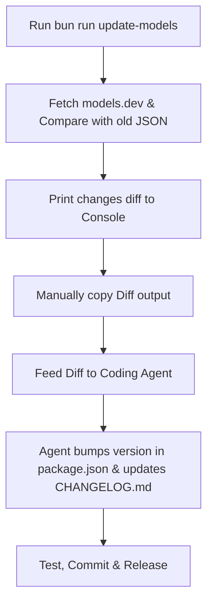

# Spec: Model Synchronization Workflow

This document outlines the workflow and specifications for synchronizing NVIDIA build models, retrieving updates, and documenting changes.

---

## 1. Synchronization & Release Steps (Workflow)



To update models and perform a new release, follow these exact steps:

### Step 1: Run the Synchronization Script
Execute the update command in the development worktree:
```bash
bun run update-models
```
**Expected Outcome**:
- The script fetches the latest model registry from `models.dev/api.json`.
- It performs a diff check against the existing `src/generated/models.json` file.
- It prints a formatted summary of all changes directly to the console (showing Added, Updated, and Removed models).
- It writes the updated metadata list to `src/generated/models.json`.

### Step 2: Feed the Diff to the Agent
Copy the console output containing the changes (diff) and prompt your Coding Agent.
**Example Prompt**:
> Here is the model update diff from the synchronization script:
> ```
> <Paste Console Diff Here>
> ```
> Based on this diff, please manually bump the version in `package.json` (SemVer minor or patch) and document the changes under the `## [Unreleased]` section of `CHANGELOG.md`.

### Step 3: Verify and Commit
Ensure the changes are correct and type-safe:
```bash
bun run check
```
Stage and commit the changes:
```bash
git add -A
git commit -m "feat: sync models and bump version to vX.Y.Z"
```

---

## 2. Core Heuristics & Filtering (Mechanism)

To maintain a clean and reliable list of chat models, the synchronization script applies the following filters and heuristic rules during the update process:

1. **Filtering Non-Chat Models**:
   Automatically skips embedding, safety guard, translation, and non-chat models based on ID pattern matching (e.g. `/embed/`, `/guard/`, `/safety/`).

2. **Attribute Estimation Fallbacks**:
   If specific metadata is missing from the raw feed, the script applies heuristics:
   - **Reasoning**: Marked `true` if ID contains terms like `r1`, `reasoning`, `thinking`, `qwq`, `glm5`.
   - **Vision Support**: Input modalities mapped to `["text", "image"]` if ID contains `vision`, `-vl`, or `multimodal`.
   - **Context Window**: Defaults to `128000` tokens, overridden based on suffixes (e.g. `1m` -> `1048576`).

3. **Provider Grouping & Sorting**:
   To keep the selector interface organized, models are grouped by creator prefix. Popular companies are pinned to the top in the following order:
   1. `moonshotai`
   2. `z-ai`
   3. `deepseek-ai`
   Within each company group, models are sorted chronologically by their release/update date (newest first).

---

## 3. Configuration Output Structure

The generated model metadata is saved in [src/generated/models.json](file:///Users/fangwang/project/coding/pi-nvidia-adapter/src/generated/models.json):
```json
{
  "models": [
    {
      "id": "deepseek-ai/deepseek-v4-flash",
      "name": "DeepSeek V4 Flash",
      "company": "deepseek-ai",
      "reasoning": true,
      "input": ["text"],
      "contextWindow": 1048576,
      "maxTokens": 16384,
      "cost": { "input": 0, "output": 0, "cacheRead": 0, "cacheWrite": 0 },
      "compat": {
        "supportsReasoningEffort": false,
        "supportsDeveloperRole": false,
        "maxTokensField": "max_tokens"
      }
    }
  ],
  "thinkingConfigs": {
    "deepseek-ai/deepseek-v4-flash": {
      "enableKwargs": { "thinking": true },
      "disableKwargs": { "thinking": false },
      "includeReasoningEffortInKwargs": true
    }
  }
}
```
The plugin imports this file at runtime to register active provider models without hardcoded updates in the main code.
